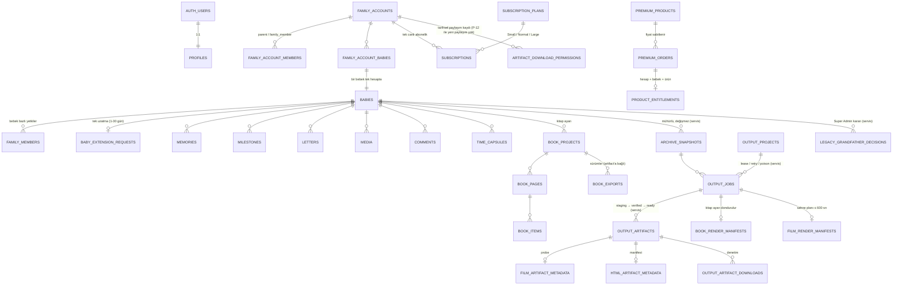

# Veri modeli (ERD)

Özet ilişki diyagramı. Tüm tablolarda RLS açıktır. "servis" ile işaretli tablolar yalnız `service_role` ve SECURITY DEFINER RPC'ler üzerinden erişilir (bkz. `supabase/tests/99z_security_audit_test.sql`).

## Yetki eksenleri

Her hassas işlem dört ekseni ayrı ayrı denetler:

| Eksen | Kaynak |
|---|---|
| Üyelik | `family_members` (bebek), `family_account_members` (hesap; `parent` / `family_member`) |
| Yaşam döngüsü | `baby_lifecycle_active_internal` (375 gün + onaylı uzatma, Europe/Istanbul) |
| Abonelik | `subscriptions` + `subscription_grants_access`, plan kapasitesi |
| Satın alma hakkı | `product_entitlements` (hesap + bebek + ürün) |

Kaynak arşiv tabloları (anı, ilk, mektup, medya, yorum, kapsül) LOCKED bebekte tetikleyici ve RLS ile salt okunurdur.
